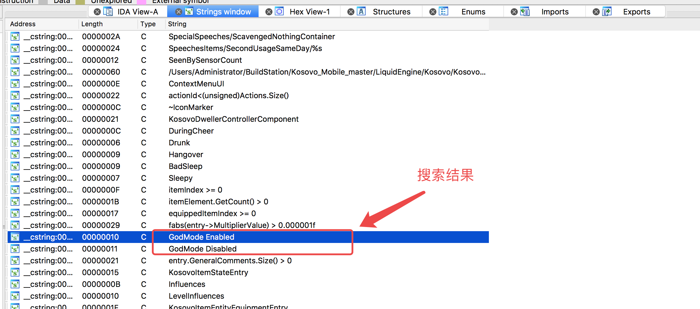
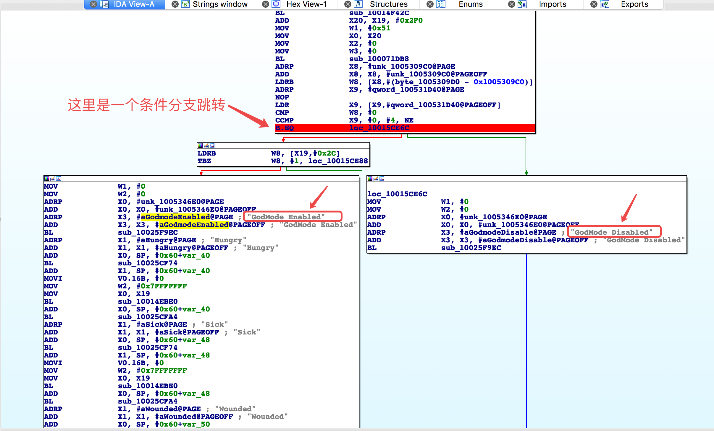
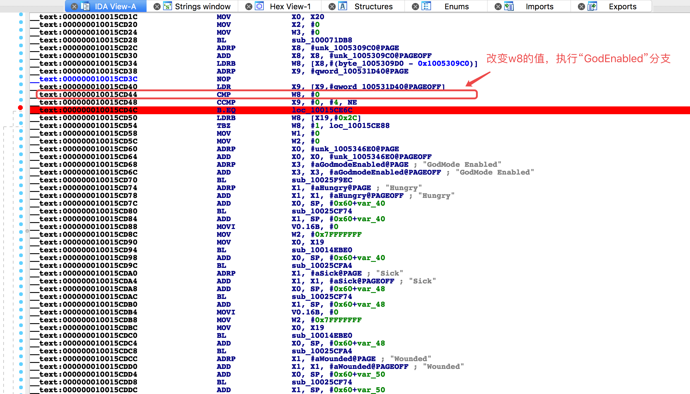
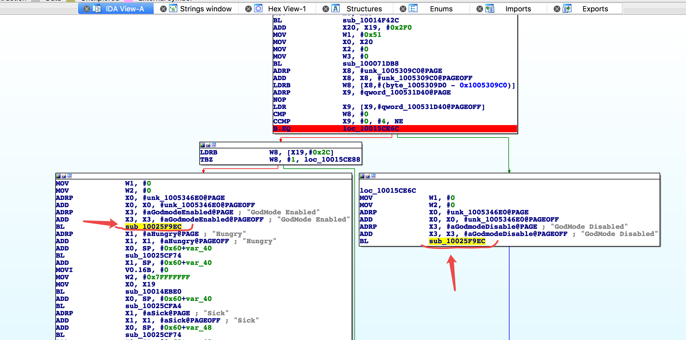

# testHookzz
iOS使用HookZz框架修改“This war of mine”游戏的逻辑，使其进入上帝模式


## 功能介绍

本项目主要目的是学习使用[HookZz](https://github.com/jmpews/HookZz)框架做iOS逆向

本项目中使用的游戏逆向思路源于[ios游戏This war of Mine 辅助开发实录](https://myhloli.com/mod-of-this-war-of-mine.html)


## 开发和使用环境

开发环境：TheOS + MonkeyDev + Xcode

分析工具：静态分析用IDA，动态分析用lldb和debugserver

使用环境：越狱的苹果手机或iPad

开发语言：OC

游戏版本：1.13.1

## 详细步骤

- 在IDA中定位到目标位置

1.把游戏的二进制文件“TWoM”拖入IDA分析，选择分析64位版本。

2.分析完成，打开“Strings window”窗口，搜索"GodMode"关键字，可以得到“GodMode Enabled”和“GodMode Disabled”。



3.根据搜索结果查看对应的汇编语句，可见“GodMode Enabled”和“GodMode Disabled”是一个条件分支。



4.查看汇编语句，使用动态调试，在 0x10015CD44 处下断点。执行到断点，打印w8的值为nil,继续执行，代码进入了“GodMode Disabled"分支。于是当下次执行到断点时，我尝试使用"register write w8 4"修改w8寄存器的值为4，继续执行，代码进入了“GodMode Enabled”分支。得出结论：修改w8的值就可以进入上帝模式。



5.使用HookZz框架中的 ZzBuildHookAddress 方法来修改w8寄存器的值。

6.“GodMode Enabled”和“GodMode Disabled” 都执行了 sub_10025F9EC 函数，根据[ios游戏This war of Mine 辅助开发实录](https://myhloli.com/mod-of-this-war-of-mine.html)的讲解，这貌似是一个打印函数，使用 MSHookFunction 来hook这个函数，在这里添加一条打印语句。



7.在Xcode中使用[MonkeyDev](https://github.com/AloneMonkey/MonkeyDev)框架创建LogosTweak项目，并编写代码。

8.编译tweak项目并安装到越狱设备，打开游戏app，查看Xcode输出的系统日志，发现输出了“GodMode Enabled”，这可以作为进入上帝模式的依据。

打印如下：
```
    Dec 18 22:41:16 Kainuo-kwj TWoM[95161] <Warning>: 测试---x8 is:开始
    Dec 18 22:41:16 Kainuo-kwj TWoM[95161] <Warning>: 测试---request(x8) is: 0
    Dec 18 22:41:16 Kainuo-kwj TWoM[95161] <Warning>: 测试---request(x8) 修改后is: 4
    Dec 18 22:41:16 Kainuo-kwj TWoM[95161] <Warning>: 测试---日志：GodMode Enabled
```

# 结束

- 代码仅供学习交流，谢绝其他非法用途，感谢您 帮忙在右上角 点个“⭐️”，非常感谢

- 大神开发的框架非常好用：

    [HookZz](https://github.com/jmpews/HookZz)框架

    [MonkeyDev](https://github.com/AloneMonkey/MonkeyDev)框架
